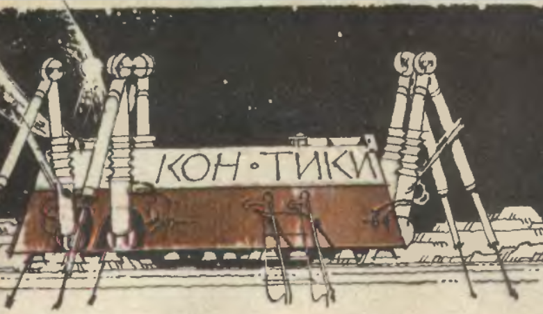

# Lunar Lander

По мотивам Lunar Lander(1979, Atari Inc.) и рассказов Михаила Пухова "Истиная правда" и "Путь к Земле", публиковавшихся в журнале "Техника молодежи" в 1985г.

*Atari Lunar Lander*

*Внешний вид лунолета "Кон-Тики" на иллюстрации к одному из рассказов*

Идея реализации графической составляющей игры взята из аркады Atari, а законы описывающие движение космического аппарта из рассказов. Данные рассказы предполагали использвание программируемых калькуляторов, таких как Б3-34, с целью повторить действия героев рассказа. В связи с этим помимо программ для калькулятора в рассказах приведены достаточно подробные ТТХ аппарата,из которых нас интересуют:

* Сухая масса: 2000 кг
* Масса топлива: 3500 кг
* Топливо: керосин-кислород
* Скорость истечения топлива: 3660 м/с
* Максимальная вертикальная скорость при посадке: 15 м/с
* Максимальная горизонтальная скорость при посадке 5 м/с

Тем не менее не все параметры нам подходят. Так например в игре максимальное количество топлива полагается 200 кг, ввиду того, что запас в 3.5 т в рассказе был необходим для преодоления пути от Луны до Земли, а не просто посадки на Луну. Так же было принято решение заменить топливную смесь керосин-кислород, на НДМГ-тетраоксид диазта, применямый в реальных спускаемых аппаратах. Для данной смеси скорость истечения равна 3120 м/с.

Используя стрелки на клавиатуре игрок может управлять углом наклона аппарата в диапазоне от -90 до 90 граудсов с шагом 5 и тягой двигателя в диапазоне от 0% до 100% с шагом 5%

Тяга двигателя рассчитывается по формуле: $F_т = \mu * v_и$,  где 

$\mu$ - текущий расход топлива,

$v_и$ - скорость истечения газов

Изменяя расход топлива от 0 до $\mu_m$, меняем тягу от 0 до $F_{тmax}$.
Максимальный расход топлива вычисляется из рассчета, что если мы хотим, чтобы полностью загруженный аппарат мог зависать и набирать высоту, тяговооруженность двигателя должна быть больше единицы. В данной игре полагается тяговоруженность равная 2.1 в начальный момент. 

Движениие корабля описывается следующими уравнениями:

$ \text{x: } F_т\cos{\alpha} = m(t)*a_x$

$ \text{y: } -F_т\sin{\alpha} + m(t)*g_л = m(t)*a_y$

$m(t) = M + M_t - \mu*t$,

где $M$ - масса аппарата, $M_t$ - максимальная масса топлива

Параметры $v_x, v_y, x, y, m$ пересчитываются через каждые $dt$ по методу Эйлера по следующим формулам:

$v_x^{i+1} = v_x^{i} + dt*(\frac{F_т  \cos{\alpha}}{m})$

$v_y^{i+1} = v_y^{i} + dt*(\frac{-F_т  \sin{\alpha} + mg}{m})$

$ x^{i+1} = x^i + v_x^i*dt$

$y^{i+1} = y^i + v_y^i*dt$

$m^{i+1} = M + (M_т^i -\mu*dt)$ 

###### Литература
1.[Lunar Lander](https://ru.wikipedia.org/wiki/Lunar_Lander)
2.[Характеристики различного топлива для ЖРД](https://ru.wikipedia.org/wiki/%D0%96%D0%B8%D0%B4%D0%BA%D0%BE%D1%81%D1%82%D0%BD%D1%8B%D0%B9_%D1%80%D0%B0%D0%BA%D0%B5%D1%82%D0%BD%D1%8B%D0%B9_%D0%B4%D0%B2%D0%B8%D0%B3%D0%B0%D1%82%D0%B5%D0%BB%D1%8C#%D0%9A%D0%BE%D0%BC%D0%BF%D0%BE%D0%BD%D0%B5%D0%BD%D1%82%D1%8B_%D1%82%D0%BE%D0%BF%D0%BB%D0%B8%D0%B2%D0%B0)
3.[История Кон-Тики](http://www.geocities.ws/levinkirill/Kon-Tiki/history.html)
4.[ТТХ Кон-Тики](http://www.geocities.ws/levinkirill/Kon-Tiki/TTX.html)
